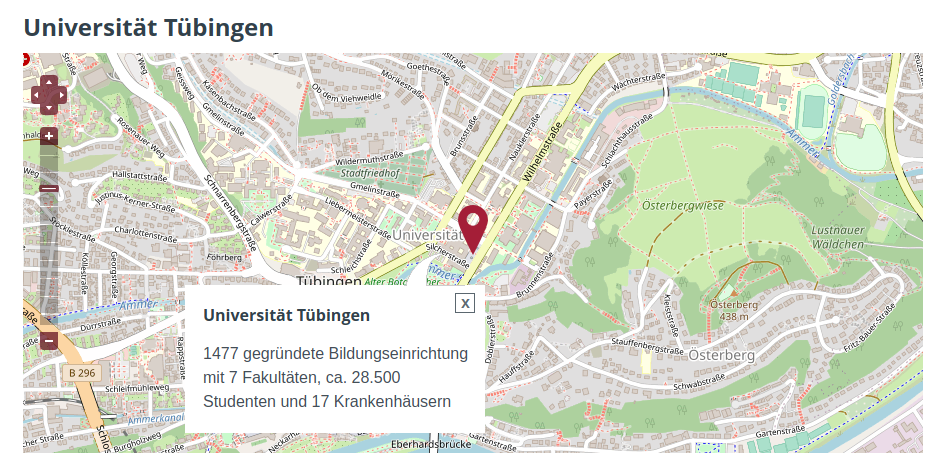
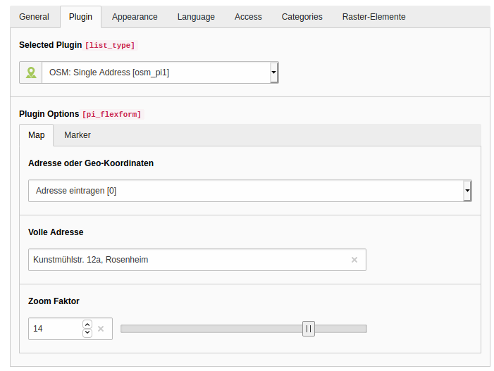
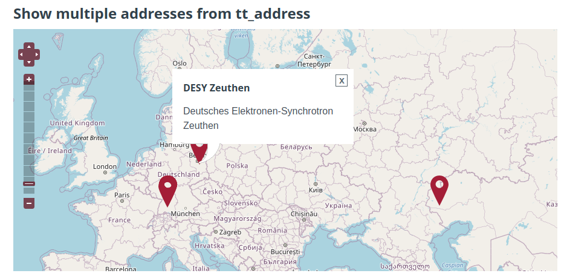
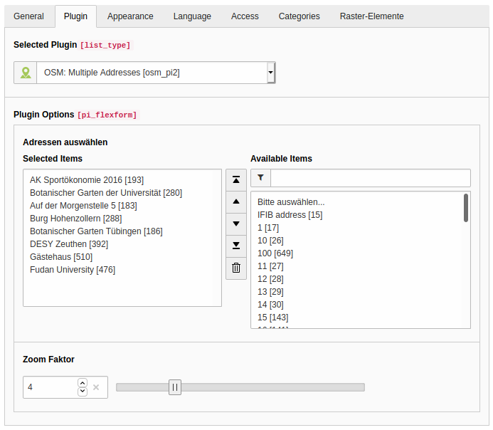

# OSM - Open Street Map

## Introduction

A small but modern OpenStreetMap extension for TYPO3 (11 and newer). You can simply show a map with or without markers.
One or more addresses can be added as human-readable address or with geo coordinates.

A second plugin allows you to show addresses from tt_address records (when tt_address.latitude and .longitude is
filled).

No jQuery, just vanilla JS. Modern asset collector used for includes of JS or CSS. PSR-14 eventdispatcher can be used
to manipulate markers and labels.

> :warning: **TYPO3 13 compatibility**\
> See [EAP page (DE)](https://www.in2code.de/agentur/typo3-extensions/early-access-programm/) or [EAP page (EN)](https://www.in2code.de/en/agency/typo3-extensions/early-access-program/) for more information how to get access to a TYPO3 12 version

## Plugin 1





## Plugin 2





**Note** Ensure that fields `tt_address.name`, `tt_address.description`, `tt_address.latitude` and
`tt_address.longitude` is filled correctly

## Installation

Add this extension via composer (TYPO3 in classic mode could work but is not supported):

`composer require in2code/osm`

Don't forget to add typeNum 1597149189 for AJAX requests for the markers to your siteconfiguration like:

```
...
routeEnhancers:
  PageTypeSuffix:
    type: PageType
    default: /
    suffix: /
    index: ''
    map:
      /: 0
      .html: 0
      'feed.xml': 9818
      'markers.json': 1597149189
...
```

## FAQ

### How to overwrite paths?

As always via TypoScript setup - like

```
plugin.tx_osm {
    view {
        templateRootPaths {
            0 = EXT:osm/Resources/Private/Templates/
            1 = EXT:yoursitepackage/Resources/Private/Templates/Extensions/Osm/
        }
        layoutRootPaths {
            0 = EXT:osm/Resources/Private/Layouts/
            1 = EXT:yoursitepackage/Resources/Private/Layouts/Extensions/Osm/
        }
    }
}
```

### How to define own css or js?

CSS and JS is included via Layout html template. You can simply adjust the paths to your needs.

### Filter address in Pi2 to some pages

If you don't want to present all available tt_address records in your FlexForm selection for your editors, you can
filter it via Page TSconfig to one or more pages like:

```
tx_osm {
  flexform {
    pi2 {
      addressPageIdentifiers = 2,3,4
    }
  }
}
```

### Manipulate markers

You can manipulate markers via PSR-14 Eventdispatcher as described.

Configuration/Services.yaml in your sitepackage:

```
services:
  Vendor\YourSitepackage\EventListener\OsmManipulator:
    tags:
      - name: event.listener
        identifier: 'osm-marker-manipulation'
        event: In2code\Osm\Domain\Model\MarkerContainer
```

Example dispatcher:

```
<?php
declare(strict_types=1);
namespace Vendor\YourSitepackage\EventListener;

use In2code\Osm\Domain\Model\Marker;
use In2code\Osm\Domain\Model\MarkerContainer;

/**
 * Class OsmManipulator as an example
 */
class OsmManipulator
{
    /**
     * @param MarkerContainer $markerContainer
     * @return void
     */
    public function __invoke(MarkerContainer $markerContainer): void
    {
        /** @var Marker $marker */
        foreach ($markerContainer->getMarkers() as $marker) {
            $marker->setMarker(1);
            $marker->setTitle('new title');
            $marker->setDescription('new description');
            $marker->setLatitude(10.00000);
            $marker->setLongitude(10.00000);
            $marker->setIcon('/typo3conf/ext/yoursitepackage/Resources/Public/Icons/Marker.png');
            $marker->setIconHeight(28);
            $marker->setIconWidth(28);
            $marker->setIconOffsetX(1);
            $marker->setIconOffsetY(-10);
        }
    }
}
```

## Changelog

| Version     | Date       | State   | Description                                                                                         |
|-------------|------------|---------|-----------------------------------------------------------------------------------------------------|
| 4.0.3       | 2024-08-23 | Bugfix  | Fix possible missing array key exception in Pi1                                                     |
| 4.0.2       | 2024-04-12 | Bugfix  | Fix problem with tt_address TCA if there is no tt_address installed                                 |
| 4.0.1       | 2024-02-05 | Bugfix  | Small bugfix for TYPO3 TER upload                                                                   |
| 4.0.0       | 2023-12-28 | Task    | Support TYPO3 12                                                                                    |
| 3.1.0       | 2023-01-11 | Task    | Prevent unneeded warning in log                                                                     |
| 3.0.0       | 2022-05-30 | Task    | Update for TYPO3 10 and 11                                                                          |
| 2.1.1       | 2022-01-24 | Bugfix  | Prevent no_cache warnings in TYPO3 log file; set correct repo url in composer.json                  |
| 2.1.0       | 2021-03-17 | Task    | Add autorelease to TER function, add extension key to composer.json                                 |
| 2.0.2       | 2020-09-30 | Bugfix  | Fix wrong translated german labels in backend for latitude/longitude.                               |
| 2.0.1       | 2020-09-21 | Task    | Small label change.                                                                                 |
| 2.0.0 (!!!) | 2020-09-18 | Feature | Allow more then only one address in Pi1 now. Allow to extend extension with PSR-14 eventdispatcher. |
| 1.2.0       | 2020-08-13 | Bugfix  | Prevent `let` in JavaScript to support old browsers. Adjust marker size.                            |
| 1.1.0       | 2020-08-13 | Task    | Some small improvements (marker image with outline, some adjustments of the views in backend)       |
| 1.0.0       | 2020-08-12 | Task    | Initial release                                                                                     |
